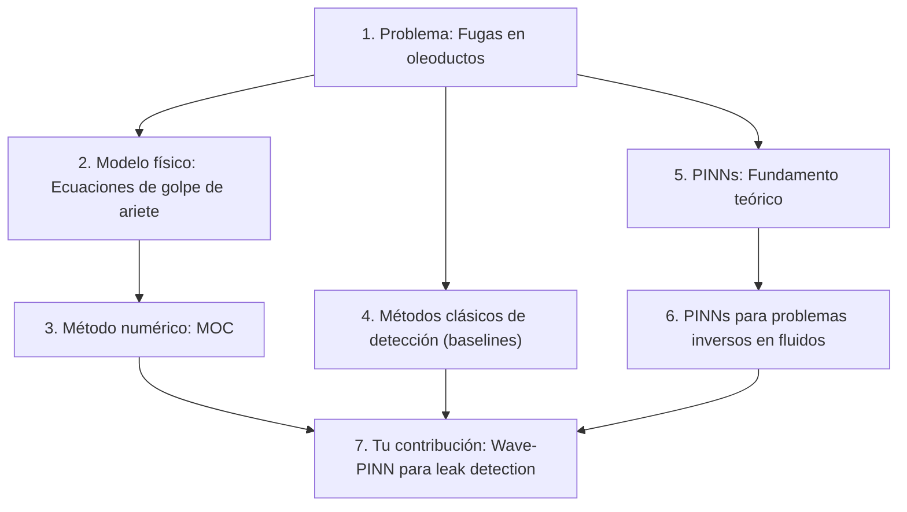

# Marco Teórico y Referencias para la Tesis

Guía de referencias bibliográficas organizadas por eje temático, vinculadas directamente con los componentes de tu proyecto.

---

## Estructura sugerida del marco teórico

---

## 1. El problema: Fugas en oleoductos

Estos papers justifican la **relevancia industrial** del problema y dan contexto sobre los métodos existentes.

### Papers fundamentales

| Ref | Paper | Año | Relevancia para tu tesis |
|-----|-------|-----|--------------------------|
| **[1]** | Murvay, P.S. & Silea, I. *"A survey on gas leak detection and localization techniques."* Journal of Loss Prevention in the Process Industries, 25(6), 966-973. | 2012 | **Review exhaustivo** de métodos de detección. Clasifica en: hardware-based (acústicos, fibra óptica) vs software-based (balance de masa, NPW, modelos). Tu trabajo cae en software-based con ML. |
| **[2]** | Adegboye, M.A., Fung, W.K., & Karnik, A. *"Recent advances in pipeline monitoring and oil leakage detection technologies."* Sensors, 19(11), 2548. | 2019 | **Review moderno** que incluye métodos de ML. Útil para posicionar tu PINN como avance sobre los métodos existentes. |
| **[3]** | Geiger, G. *"State-of-the-art in leak detection and localisation."* Oil Gas European Magazine, 32(4), 193-198. | 2006 | **Perspectiva industrial** sobre los estándares API 1130 y API 1149 que rigen la detección de fugas en la industria. |

> [!TIP]
> **Cómo usar estas refs:** En la introducción, citas [1] y [2] para justificar que el problema es relevante y que los métodos actuales tienen limitaciones (latencia, falsos positivos con ruido). Citas [3] para mostrar que conocés los estándares industriales.

---

## 2. Modelo físico: Ecuaciones de flujo transitorio en tuberías

Tu simulador ([simulator.py](file:///d:/MCD_24-26/PROYECTO_FINAL_PINN/simulator.py)) resuelve las ecuaciones de golpe de ariete (water hammer) 1D. Estas son las ecuaciones de Navier-Stokes simplificadas para flujo en tuberías.

### Ecuaciones que tu código resuelve

Las dos EDPs acopladas del flujo transitorio 1D son:

**Continuidad:**
$$\frac{\partial P}{\partial t} + \frac{\rho a^2}{A} \frac{\partial Q}{\partial x} = 0$$

**Momentum:**
$$\frac{\partial Q}{\partial t} + \frac{A}{\rho} \frac{\partial P}{\partial x} + \frac{f Q |Q|}{2DA} = 0$$

> [!IMPORTANT]
> Estas ecuaciones aparecen en tu código en [wave_pinn.py L201-L217](file:///d:/MCD_24-26/PROYECTO_FINAL_PINN/wave_pinn.py#L201-L217) como `r_cont` y `r_mom`. Es importante que en la tesis derives explícitamente cómo se llega de Navier-Stokes a estas ecuaciones simplificadas.

### Papers fundamentales

| Ref | Paper | Año | Relevancia |
|-----|-------|-----|------------|
| **[4]** | Chaudhry, M.H. *"Applied Hydraulic Transients."* Springer (3rd ed.) | 2014 | **El libro de referencia** para flujo transitorio en tuberías. Capítulos 2-3 derivan las ecuaciones que usás. Capítulo 3 es MOC. |
| **[5]** | Wylie, E.B. & Streeter, V.L. *"Fluid Transients in Systems."* Prentice Hall. | 1993 | **El otro clásico.** Más orientado a ingeniería. Derivación completa de las ecuaciones de compatibilidad C+ y C−. |
| **[6]** | Ghidaoui, M.S., Zhao, M., McInnis, D.A., & Axworthy, D.H. *"A review of water hammer theory and practice."* Applied Mechanics Reviews, 58(1), 49-76. | 2005 | **Review muy citado.** Conecta la teoría con la práctica. Sección sobre fricción no-estacionaria es relevante porque tu modelo usa Darcy-Weisbach estacionario. |

> [!NOTE]
> **Conexión con tu código:** En [config.py](file:///d:/MCD_24-26/PROYECTO_FINAL_PINN/config.py) definís `WAVE_SPEED = 1200 m/s`, `FRICTION_FACTOR = 0.02`, `FLUID_DENSITY = 850 kg/m³`. Estos valores corresponden a un oleoducto de crudo típico. Citar [4] o [5] para justificar los rangos de parámetros.

---

## 3. Método de las Características (MOC)

Tu simulador usa MOC clásico con CFL=1 exacto (`dt = dx/a`). Las líneas características C+ y C− se resuelven explícitamente.

### Papers fundamentales

| Ref | Paper | Año | Relevancia |
|-----|-------|-----|------------|
| **[4]** | Chaudhry (ya citado arriba) | 2014 | Capítulo 3: derivación completa del MOC para flujo transitorio. |
| **[7]** | Shamloo, H. & Haghighi, A. *"Leak detection in pipelines by inverse transient analysis."* Journal of Hydraulic Research, 47(3), 311-318. | 2009 | **Directamente relevante:** usa MOC para generar datos sintéticos y luego resuelve el problema inverso (localizar fuga). Es exactamente tu pipeline pero con optimización clásica en vez de PINN. |
| **[8]** | Liggett, J.A. & Chen, L.C. *"Inverse transient analysis in pipe networks."* Journal of Hydraulic Engineering, 120(8), 934-955. | 1994 | **Paper seminal** del problema inverso de detección de fugas usando análisis transitorio. Tu PINN reemplaza la optimización clásica que ellos proponen. |

> [!IMPORTANT]
> **Clave para la tesis:** [7] y [8] son la justificación directa de tu enfoque. Ellos resuelven el mismo problema inverso pero con métodos de optimización clásicos (Levenberg-Marquardt, etc.). Tu aporte es reemplazar eso con una PINN, que es más flexible y no requiere derivadas del modelo forward.

---

## 4. Métodos clásicos de detección (tus baselines)

Tu código implementa tres baselines. Cada uno necesita su justificación.

### Balance de masa + NPW (Negative Pressure Wave)

Implementado en [baseline_mass_balance.py](file:///d:/MCD_24-26/PROYECTO_FINAL_PINN/baseline_mass_balance.py).

| Ref | Paper | Año | Relevancia |
|-----|-------|-----|------------|
| **[9]** | API 1130 *"Computational Pipeline Monitoring for Liquids Pipelines."* American Petroleum Institute. | 2007 | **Estándar industrial** que define balance de masa como método CPM. Tu baseline implementa esto. |
| **[10]** | Silva, R.A., Buiatti, C.M., Cruz, S.L., & Pereira, J.A.F.R. *"Pressure wave behaviour and leak detection in pipelines."* Computers & Chemical Engineering, 20, S491-S496. | 1996 | Fundamento del método NPW. La fórmula de triangulación $x = \frac{L + a \Delta t}{2}$ que usás viene de acá. |

### LSTM (tu baseline data-driven)

| Ref | Paper | Año | Relevancia |
|-----|-------|-----|------------|
| **[11]** | Hochreiter, S. & Schmidhuber, J. *"Long short-term memory."* Neural Computation, 9(8), 1735-1780. | 1997 | Paper original de LSTM. Citá como ref de la arquitectura. |
| **[12]** | Zhou, S., Niu, Y., Liu, Y., Bao, J., & Li, S. *"Deep learning-based pipeline leak detection."* Machine Learning with Applications, 14, 100516. | 2023 | Paper reciente que usa deep learning para detección de fugas. Útil para comparar con tu enfoque. |

---

## 5. Physics-Informed Neural Networks (PINNs): Fundamento teórico

Este es el **corazón** de tu tesis. Necesitás una sección sólida que cubra desde el paper seminal hasta los avances recientes.

### Papers fundamentales (OBLIGATORIOS)

| Ref | Paper | Año | Relevancia |
|-----|-------|-----|------------|
| **[13]** | Raissi, M., Perdikaris, P., & Karniadakis, G.E. *"Physics-informed neural networks: A deep learning framework for solving forward and inverse problems involving nonlinear partial differential equations."* Journal of Computational Physics, 378, 686-707. | 2019 | **EL paper fundacional de PINNs.** Ya tenés el PDF (`raissi2019.pdf`). Define el framework que usás: red neuronal + residuos de PDE en la función de loss. Secciones 3-4 son las más relevantes. |
| **[14]** | Raissi, M., Yazdani, A., & Karniadakis, G.E. *"Hidden fluid mechanics: Learning velocity and pressure fields from flow visualizations."* Science, 367(6481), 1026-1030. | 2020 | **PINNs aplicadas a mecánica de fluidos.** Paper en Science que muestra que PINNs pueden resolver Navier-Stokes. Muy útil para justificar la aplicación de PINNs a tu problema de flujo en tuberías. |
| **[15]** | Karniadakis, G.E., Kevrekidis, I.G., Lu, L., Perdikaris, P., Wang, S., & Yang, L. *"Physics-informed machine learning."* Nature Reviews Physics, 3, 422-440. | 2021 | **Review en Nature Reviews Physics.** Da el panorama general de PINNs y sus variantes. Muy citado, imprescindible en tu marco teórico. |

### Papers sobre problemas inversos con PINNs

| Ref | Paper | Año | Relevancia |
|-----|-------|-----|------------|
| **[16]** | Lu, L., Meng, X., Mao, Z., & Karniadakis, G.E. *"DeepXDE: A deep learning library for solving differential equations."* SIAM Review, 63(1), 208-228. | 2021 | Framework DeepXDE. Aunque no lo usás, describe bien la formulación del problema inverso con PINNs que es exactamente lo que hacés. |
| **[17]** | Jagtap, A.D., Kawaguchi, K., & Karniadakis, G.E. *"Adaptive activation functions accelerate convergence in deep and physics-informed neural networks."* Journal of Computational Physics, 404, 109136. | 2020 | Activaciones adaptativas para PINNs. Relevante porque tu red usa `tanh` fijo — podés mencionar esto como trabajo futuro. |

### Papers sobre entrenamiento y dificultades de PINNs

| Ref | Paper | Año | Relevancia |
|-----|-------|-----|------------|
| **[18]** | Wang, S., Teng, Y., & Perdikaris, P. *"Understanding and mitigating gradient flow pathologies in physics-informed neural networks."* SIAM Journal on Scientific Computing, 43(5), A3055-A3081. | 2021 | **Muy relevante** para tu estrategia de entrenamiento multi-fase. Explica por qué los gradientes de los diferentes términos de loss compiten entre sí, que es exactamente lo que tu esquema de fases (Phase 1: alineación, Phase 2: fricción, Phase 3: fino) intenta resolver. |
| **[19]** | Wang, S., Yu, X., & Perdikaris, P. *"When and why PINNs fail to train: A neural tangent kernel perspective."* Journal of Computational Physics, 449, 110768. | 2022 | Análisis de por qué PINNs fallan. Útil para justificar tus decisiones de diseño (Xavier init, curriculum learning del parámetro `k`, etc.) |
| **[20]** | Krishnapriyan, A.S., Gholami, A., Zhe, S., Kirby, R.M., & Mahoney, M.W. *"Characterizing possible failure modes in physics-informed neural networks."* NeurIPS 2021. | 2021 | Modos de falla de PINNs. Relevante para discutir las limitaciones de tu modelo. |

> [!TIP]
> **Conexión directa con tu código:** Tu estrategia de entrenamiento en 3 fases ([wave_pinn.py L320-L322](file:///d:/MCD_24-26/PROYECTO_FINAL_PINN/wave_pinn.py#L320-L322)) y el curriculum del parámetro `k` en [compute_k](file:///d:/MCD_24-26/PROYECTO_FINAL_PINN/wave_pinn.py#L182-L192) son técnicas que están justificadas por los hallazgos de [18] y [19]. Asegurate de conectar explícitamente estas decisiones con la literatura.

---

## 6. PINNs para problemas inversos en flujos y tuberías

Estos papers son los **más cercanos** a tu trabajo y forman la base directa de tu contribución.

| Ref | Paper | Año | Relevancia |
|-----|-------|-----|------------|
| **[21]** | Almajid, M.M. & Abu-Al-Saud, M.O. *"Prediction of porous media fluid flow using physics informed neural networks."* Journal of Petroleum Science and Engineering, 208, 109205. | 2022 | PINNs para flujo en medios porosos (petróleo). Mismo dominio de aplicación. |
| **[22]** | Cai, S., Mao, Z., Wang, Z., Yin, M., & Karniadakis, G.E. *"Physics-informed neural networks (PINNs) for fluid mechanics: A review."* Acta Mechanica Sinica, 37, 1727-1738. | 2021 | **Review de PINNs para fluidos.** Cubre forward e inverse problems. Sección sobre problemas inversos es directamente aplicable a tu tesis. |
| **[23]** | Tariq, Z., Alwazani, T., Siddiqui, S.A., & Mahmoud, M. *"Physics-informed neural networks for pipeline leak detection."* SPE Annual Technical Conference and Exhibition. | 2023 | **El más cercano a tu trabajo.** PINNs para detección de fugas en tuberías. Citarlo y diferenciarte (tu aporte: wave injection, q_leak learnable, benchmark factorial). |

> [!WARNING]
> **Paper [23] es clave:** Es tu competencia directa. Leelo con cuidado para entender qué hacen diferente y cómo posicionar tu contribución. Si no lo encontrás en SPE, buscá en Google Scholar "PINN pipeline leak detection" para encontrar los papers más recientes en este nicho específico.

---

## 7. Tu contribución: Qué es nuevo

Basándote en la literatura, tu tesis aporta:

1. **Wave Injection Architecture:** La descomposición del campo en `P_ss + P_mlp_res + P_sing` ([wave_pinn.py L167-L169](file:///d:/MCD_24-26/PROYECTO_FINAL_PINN/wave_pinn.py#L167-L169)) no es estándar en la literatura de PINNs. La idea de inyectar la solución analítica de la onda de choque directamente en la arquitectura para que la red solo aprenda el residual es una contribución técnica.

2. **Doble problema inverso:** La mayoría de los papers de leak detection con PINNs asumen `q_leak` conocido. Inferir **simultáneamente** `x_leak` y `q_leak` como parámetros aprendibles ([wave_pinn.py L104-L110](file:///d:/MCD_24-26/PROYECTO_FINAL_PINN/wave_pinn.py#L104-L110)) es más ambicioso.

3. **Benchmark sistemático:** El diseño factorial (4 posiciones × 3 tamaños × niveles de ruido) comparando PINN vs baselines industriales (Balance de Masa, NPW, LSTM) es un aporte metodológico.

4. **Análisis de robustez al ruido:** Pocos papers evalúan PINNs bajo múltiples niveles de ruido de sensores de forma sistemática.

---

## Orden sugerido de escritura

| Orden | Sección | Refs principales | Tip |
|-------|---------|-------------------|-----|
| 1° | Introducción y motivación | [1], [2], [3] | Plantear el problema industrial, las limitaciones de los métodos actuales |
| 2° | Ecuaciones de flujo transitorio | [4], [5], [6] | Derivar las EDPs desde N-S hasta las ecuaciones de compatibilidad |
| 3° | Método de las Características | [4], [7], [8] | Describir MOC como generador de datos sintéticos |
| 4° | PINNs: Fundamento teórico | [13], [14], [15] | El framework general, forward vs inverse |
| 5° | Dificultades de entrenamiento | [18], [19], [20] | Justificar tus decisiones de diseño |
| 6° | Estado del arte: PINNs + fluidos | [22], [23] | Posicionar tu trabajo respecto a lo existente |
| 7° | Metodología (tu contribución) | — | Describir Wave-PINN, wave injection, 3 fases |
| 8° | Baselines de comparación | [9], [10], [11] | Balance de masa, NPW, LSTM |
| 9° | Resultados y discusión | — | Benchmark factorial |

> [!TIP]
> **Por dónde empezar:** Te recomiendo empezar por las secciones 4° y 5° (PINNs), porque es el **aporte central** de tu tesis y necesitás entender bien la literatura para posicionar tu contribución. Luego 2° y 3° (las ecuaciones y MOC) porque ya tenés el código funcionando y solo falta formalizarlo. Finalmente, la introducción se escribe al final cuando ya tenés claro todo el panorama.
